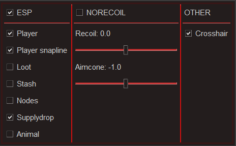
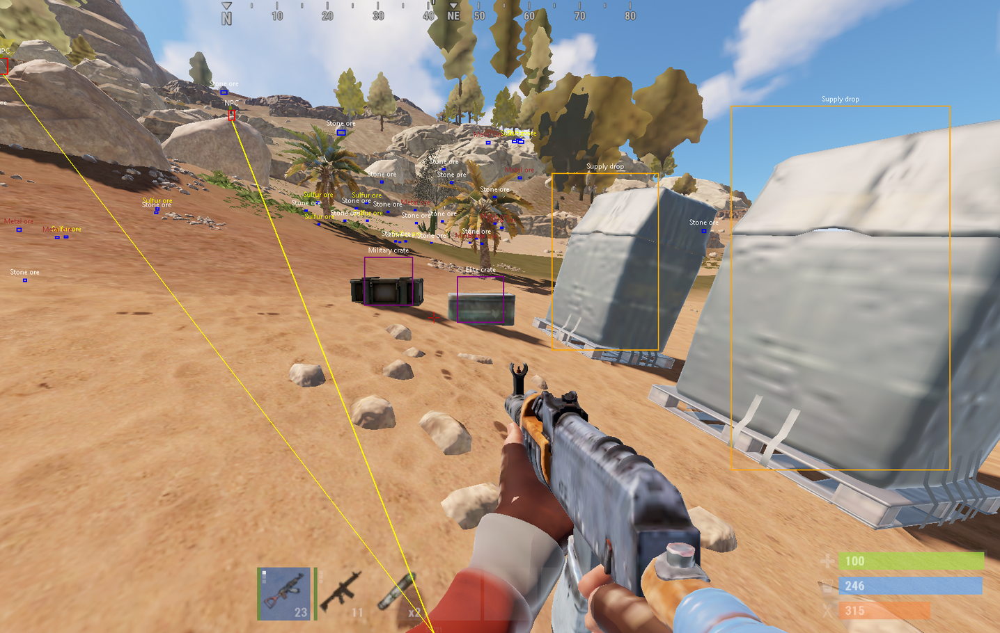

# rustcheat-python

https://www.unknowncheats.me/forum/rust/456831-cheat-purely-python.html

A cheat software for Facepunch's Rust that I have done back in 2020... (purely in Python 3) I found this project on my old HDD and I no longer have any use for this, so I decided to share.

Offsets & Pointers are 100% outdated.

This won't work on any EAC enabled server.

